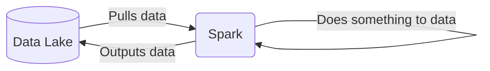
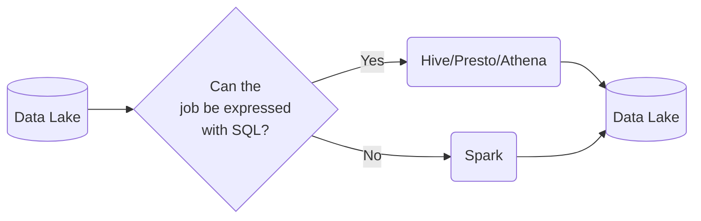

## Batch Processing

There are 2 ways of processing data:
* ***Batch processing***: processing _chunks_ of data at _regular intervals_.
    * Example: processing taxi trips each month.
        ```mermaid
        graph LR;
            a[(taxi trips DB)]-->b(batch job)
            b-->a
        ```
* ***Streaming***: processing data _on the fly_.
    * Example: processing a taxi trip as soon as it's generated.
        ```mermaid
        graph LR;
            a{{User}}-. gets on taxi .->b{{taxi}}
            b-- ride start event -->c([data stream])
            c-->d(Processor)
            d-->e([data stream])
            
            
## Types of batch jobs

A ***batch job*** is a ***job*** (a unit of work) that will process data in batches.

Batch jobs may be _scheduled_ in many ways:

* Weekly
* Daily (very common)
* Hourly (very common)
* X timnes per hous
* Every 5 minutes
* Etc...


## Pros and cons of batch jobs

* Advantages:
    * Easy to manage. There are multiple tools to manage them (the technologies we already mentioned)
    * Re-executable. Jobs can be easily retried if they fail.
    * Scalable. Scripts can be executed in more capable machines; Spark can be run in bigger clusters, etc.
* Disadvantages:
    * Delay. Each task of the workflow in the previous section may take a few minutes; assuming the whole workflow takes 20 minutes, we would need to wait those 20 minutes until the data is ready for work.

However, the advantages of batch jobs often compensate for its shortcomings, and as a result most companies that deal with data tend to work with batch jobs mos of the time (probably 90%).


## What is Spark?

[Apache Spark](https://spark.apache.org/) is an open-source ***multi-language*** unified analytics ***engine*** for large-scale data processing.

Spark is an ***engine*** because it _processes data_.



Spark can be ran in _clusters_ with multiple _nodes_, each pulling and transforming data.

Spark is ***multi-language*** because we can use Java and Scala natively, and there are wrappers for Python, R and other languages.

The wrapper for Python is called [PySpark](https://spark.apache.org/docs/latest/api/python/).

Spark can deal with both batches and streaming data. The technique for streaming data is seeing a stream of data as a sequence of small batches and then applying similar techniques on them to those used on regular badges. We will cover streaming in detail in the next lesson.

## Why do we need Spark?

Spark is used for transforming data in a Data Lake.

There are tools such as Hive, Presto or Athena (a AWS managed Presto) that allow you to express jobs as SQL queries. However, there are times where you need to apply more complex manipulation which are very difficult or even impossible to express with SQL (such as ML models); in those instances, Spark is the tool to use.



A typical workflow may combine both tools. Here's an example of a workflow involving Machine Learning:


In this scenario, most of the preprocessing would be happening in Athena, so for everything that can be expressed with SQL, it's always a good idea to do so, but for everything else, there's Spark.
