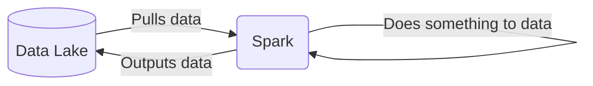
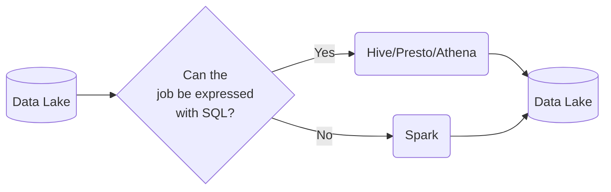
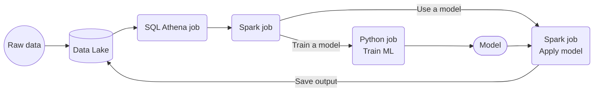

## Batch Processing

Using Apache Spark, we will be loading the data from Google Cloud Storage(GCS) to BigQuery by doing some transformations.

There are 2 ways of processing data:
* ***Batch processing***: processing _chunks_ of data at _regular intervals_.
    * Example: processing taxi trips each month.
        ```mermaid
        graph LR;
            a[(taxi trips DB)]-->b(batch job)
            b-->a
        ```
* ***Streaming***: processing data _on the fly_.
    * Example: processing a taxi trip as soon as it's generated.
        ```mermaid
        graph LR;
            a{{User}}-. gets on taxi .->b{{taxi}}
            b-- ride start event -->c([data stream])
            c-->d(Processor)
            d-->e([data stream])
            
            
## Types of batch jobs

A ***batch job*** is a ***job*** (a unit of work) that will process data in batches.

Batch jobs may be _scheduled_ in many ways:

* Weekly
* Daily (very common)
* Hourly (very common)
* X timnes per hous
* Every 5 minutes
* Etc...


## Pros and cons of batch jobs

* Advantages:
    * Easy to manage. There are multiple tools to manage them (the technologies we already mentioned)
    * Re-executable. Jobs can be easily retried if they fail.
    * Scalable. Scripts can be executed in more capable machines; Spark can be run in bigger clusters, etc.
* Disadvantages:
    * Delay. Each task of the workflow in the previous section may take a few minutes; assuming the whole workflow takes 20 minutes, we would need to wait those 20 minutes until the data is ready for work.

However, the advantages of batch jobs often compensate for its shortcomings, and as a result most companies that deal with data tend to work with batch jobs mos of the time (probably 90%).


## What is Spark?

[Apache Spark](https://spark.apache.org/) is an open-source ***multi-language*** unified analytics ***engine*** for large-scale data processing.

Spark is an ***engine*** because it _processes data_.



Spark can be ran in _clusters_ with multiple _nodes_, each pulling and transforming data.

Spark is ***multi-language*** because we can use Java and Scala natively, and there are wrappers for Python, R and other languages.

The wrapper for Python is called [PySpark](https://spark.apache.org/docs/latest/api/python/).

Spark can deal with both batches and streaming data. The technique for streaming data is seeing a stream of data as a sequence of small batches and then applying similar techniques on them to those used on regular badges. We will cover streaming in detail in the next lesson.

## Why do we need Spark?

Spark is used for transforming data in a Data Lake.

There are tools such as Hive, Presto or Athena (a AWS managed Presto) that allow you to express jobs as SQL queries. However, there are times where you need to apply more complex manipulation which are very difficult or even impossible to express with SQL (such as ML models); in those instances, Spark is the tool to use.



A typical workflow may combine both tools. Here's an example of a workflow involving Machine Learning:



## Setting up a Dataproc Cluster

### Creating the cluster


[Dataproc](https://cloud.google.com/dataproc) is Google's cloud-managed service for running Spark and other data processing tools such as Flink, Presto, etc.

You may access Dataproc from the GCP dashboard and typing `dataproc` on the search bar. The first time you access it you will have to enable the API.

In the images below you may find some example values for creating a simple cluster. Give it a name of your choosing and choose the same region as your bucket.


We would normally choose a `standard` cluster, but you may choose `single node` if you just want to experiment and not run any jobs.


Optionally, you may install additional components but we won't be covering them in this lesson.


You may leave all other optional settings with their default values. After you click on `Create`, it will take a few seconds to create the cluster. You may notice an extra VM instance under VMs; that's the Spark instance.

### Running a job with the web UI

In Dataproc's _Clusters_ page, choose your cluster and un the _Cluster details_ page, click on `Submit job`. Under _Job type_ choose `PySpark`, then in _Main Python file_ write the path to your script (you may upload the script to your bucket and then copy the URL).


Make sure that your script does not specify the `master` cluster! Your script should take the connection details from Dataproc; make sure it looks something like this:

```python
spark = SparkSession.builder \
    .appName('test') \
    .getOrCreate()
```

We also need to specify arguments as shown in the below image.


Now press `Submit`. Sadly there is no easy way to access the Spark dashboard but you can check the status of the job from the `Job details` page.

### Running a job with the gcloud SDK

Besides the web UI, there are additional ways to run a job, listed [in this link](https://cloud.google.com/dataproc/docs/guides/submit-job). We will focus on the gcloud SDK now.

Before you can submit jobs with the SDK, you will need to grant permissions to the Service Account we've been using so far. Go to _IAM & Admin_ and edit your Service Account so that the `Dataproc Administrator` role is added to it.

We can now submit a job from the command line, like this:

```bash
gcloud dataproc jobs submit pyspark \
    --cluster=ny-taxi-cluster \
    --region=europe-west6 \
    --jars=gs://spark-lib/bigquery/spark-bigquery-latest_2.12.jar \
    gs://dtc_data_lake_taxi-rides-ny-375905/spark_sql_bg.py \
    -- \
        --input_green=gs://dtc_data_lake_taxi-rides-ny-375905/data/green/*/ \
        --input_yellow=gs://dtc_data_lake_taxi-rides-ny-375905/data/yellow/*/ \
        --output=taxi_trips.reports
```

You may find more details on how to run jobs [in the official docs](https://cloud.google.com/dataproc/docs/guides/submit-job).


